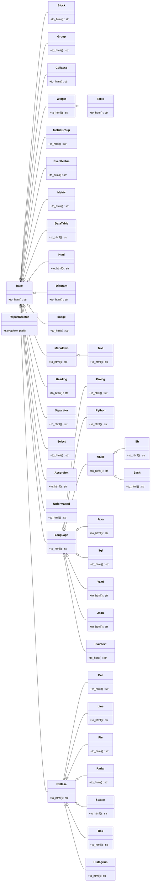

# Report Creator

## Class Diagram

```mermaid
classDiagram
    direction LR
    class Base {
        +to_html() str
    }

    class Block {
        +to_html() str
    }
    Base <|-- Block

    class Group {
        +to_html() str
    }
    Base <|-- Group

    class Collapse {
        +to_html() str
    }
    Base <|-- Collapse

    class Widget {
        +to_html() str
    }
    Base <|-- Widget

    class MetricGroup {
        +to_html() str
    }
    Base <|-- MetricGroup

    class EventMetric {
        +to_html() str
    }
    Base <|-- EventMetric

    class Metric {
        +to_html() str
    }
    Base <|-- Metric

    class Table {
        +to_html() str
    }
    Widget <|-- Table

    class DataTable {
        +to_html() str
    }
    Base <|-- DataTable

    class Html {
        +to_html() str
    }
    Base <|-- Html

    class Diagram {
        +to_html() str
    }
    Base <|-- Diagram

    class Image {
        +to_html() str
    }
    Base <|-- Image

    class Markdown {
        +to_html() str
    }
    Base <|-- Markdown

    class Text {
        +to_html() str
    }
    Markdown <|-- Text

    class Heading {
        +to_html() str
    }
    Base <|-- Heading

    class Separator {
        +to_html() str
    }
    Base <|-- Separator

    class Select {
        +to_html() str
    }
    Base <|-- Select

    class Accordion {
        +to_html() str
    }
    Base <|-- Accordion

    class Unformatted {
        +to_html() str
    }
    Base <|-- Unformatted

    class Language {
        +to_html() str
    }
    Base <|-- Language

    class Prolog {
        +to_html() str
    }
    Language <|-- Prolog

    class Python {
        +to_html() str
    }
    Language <|-- Python

    class Shell {
        +to_html() str
    }
    Language <|-- Shell

    class Sh {
        +to_html() str
    }
    Shell <|-- Sh

    class Bash {
        +to_html() str
    }
    Shell <|-- Bash

    class Java {
        +to_html() str
    }
    Language <|-- Java

    class Sql {
        +to_html() str
    }
    Language <|-- Sql

    class Yaml {
        +to_html() str
    }
    Language <|-- Yaml

    class Json {
        +to_html() str
    }
    Language <|-- Json

    class Plaintext {
        +to_html() str
    }
    Language <|-- Plaintext

    class PxBase {
        +to_html() str
    }
    Base <|-- PxBase

    class Bar {
        +to_html() str
    }
    PxBase <|-- Bar

    class Line {
        +to_html() str
    }
    PxBase <|-- Line

    class Pie {
        +to_html() str
    }
    PxBase <|-- Pie

    class Radar {
        +to_html() str
    }
    PxBase <|-- Radar

    class Scatter {
        +to_html() str
    }
    PxBase <|-- Scatter

    class Box {
        +to_html() str
    }
    PxBase <|-- Box

    class Histogram {
        +to_html() str
    }
    PxBase <|-- Histogram

    class ReportCreator {
        +save(view, path)
    }
```
