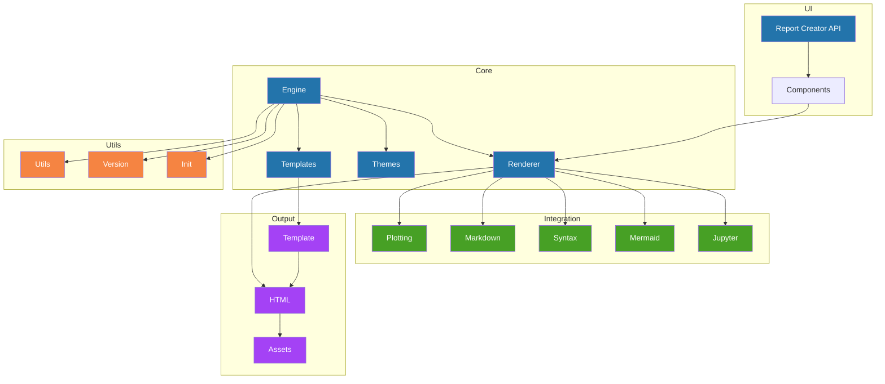

# Report Creator

[](https://www.apache.org/licenses/LICENSE-2.0)
[](https://pypi.org/project/report_creator)
[](https://pypi.org/project/report_creator)
[](https://pypi.org/project/report_creator)
[](https://discord.gg/c4VZp5ze)

[GitHub](https://github.com/darenr/report_creator) | 
[PyPI](https://pypi.org/project/report_creator/) | 
[Documentation](https://report-creator.readthedocs.io) | 
[Issues](https://github.com/darenr/report_creator/issues) | 
[Getting Started](https://report-creator.readthedocs.io/en/latest/getting_started.html)

Library to assemble reports in HTML from various components using python. This is not meant to be a replacement for do-it-yourself HTML,
it's a tool to put together professional looking reports from python easily and quickly. The philosophy for layout is that components flow in
either the horizontal (`rc.Group`) or Vertical (`rc.Block`) direction.

## ⚡ Features

- [x] Good pandas/dataframe/table support
- [x] Look modern
- [x] Allows markdown as input for text blocks
- [x] Allows html as input
- [x] Components for things like metrics ("Accuracy: 87%") from a key & value
- [x] Support for plotting figures, interactive `plotly` and `matplotlib`
- [x] images (styled by the library) with an option to fetch at report build time (no fetch on render)
- [x] `json`/`yaml`/`python`/`java`/`prolog` code blocks with color syntax highlighting
- [x] Support tab containers (not printer friendly)
- [x] Add support for any Jupyter widget, any object that renders in a notebook should render to a report
- [x] Add built-in easy plotting that looks stylistically consistent with the report
- [x] Add option to change the report icon based on a github account avatar, or an image
- [x] Add a metric type for timeseries data which should some aggregate function of the data, and plot over time.
- [x] Add diagram component with Mermaid JS
- [x] Write documentation!
- [x] Add a status metric that supports up to a handful of k/v pairs (k=task, v=status)
- [x] Add bookmark anchors to blocks
- [x] Add Footer to report
- [x] Add accordion component
- [x] Add option for color logo (uses accent color param passed to ReportCreator ctor)
- [x] Clean up docs build, move requirements-doc into docs/environment.yaml "- -r requirements.txt"
- [x] Add mistune plugin to allow gfk markdown icons - `:icon-name:`, for example `:pizza:`
- [ ] Add a Metric type for a sortable set of key/values rendered like this [Percent of time](https://www.googlecloudcommunity.com/gc/image/serverpage/image-id/73682iEC88C630172A41FA/image-size/large)
- [ ] Progress component
- [ ] Add Venn diagram support (possibly with `matplotlib_venn`, or SVG)
- [ ] Add Radar chart
- [ ] Add choropleth map plot type (maybe?)
- [ ] Youtube embeds rc.Video(url: str, label: str)
- [ ] File attachments (downloadable dataset from page)

## ⚡ Example

```python
import report_creator as rc

with rc.ReportCreator(
    title="My Report",
    description="My Report Description",
    footer="My Report Footer",
) as report:
    view = rc.Block(
        rc.Text(
            """It was the best of times, it was the worst of times, it was the age of wisdom, it was the age of foolishness, it was the epoch of belief, it was the epoch of incredulity, it was the season of light, it was the season of darkness, it was the spring of hope, it was the winter of despair.""",
            label="Charles Dickens, A Tale of Two Cities",
        ),
        rc.Group(
            rc.Metric(
                heading="Answer to Life, The Universe, and Everything",
                value="42",
            ),
            rc.Metric(
                heading="Author",
                value="Douglas Adams",
            ),
        ),
        rc.Bar(
            px.data.medals_long(),
            x="nation",
            y="count",
            dimension="medal",
            label="Bar Chart - Olympic Medals",
        ),
        rc.Scatter(
            px.data.iris(),
            x="sepal_width",
            y="sepal_length",
            dimension="species",
            marginal="histogram",
            label="Scatter Plot - Iris",
        ),
    )

    report.save(view, "report.html")
```

## 🤗 Code Structure



## 🤗 Development

```sh
conda create --name rc python=3.13
conda activate rc
make setup

# recommended for code hygiene
make format

# install as a local package:
python3 -m pip install -e .

# see dependency tree:
pipdeptree --exclude pip,pipdeptree,setuptools,wheel,twine

# build examples:
make examples

# build a *specific* example:
make examples EXAMPLES=examples/myreport.py

# run tests
make tests

# build docs
make docs

# release new version
make release

# show list of make targets
make targets

```

## Get in touch

This project is under active development

- Report bugs via [GitHub Issues](https://github.com/darenr/report_creator/issues).
- Chat with the maintainers on [Discord](https://discord.com/channels/1318814951795593236/1318814951795593239).