# Report Creator

[](https://www.apache.org/licenses/LICENSE-2.0)
[](https://pypi.org/project/report_creator)
[](https://pypi.org/project/report_creator)
[](https://pypi.org/project/report_creator)

[GitHub](https://github.com/darenr/report_creator) |
[PyPI](https://pypi.org/project/report_creator/) |
[Documentation](https://report-creator.readthedocs.io) |
[Issues](https://github.com/darenr/report_creator/issues) |
[Getting Started](https://report-creator.readthedocs.io/en/latest/getting_started.html)

Library to assemble reports in HTML from various components using python. This is not meant to be a replacement for do-it-yourself HTML,
it's a tool to put together professional looking reports from python easily and quickly. The philosophy for layout is that components flow in
either the horizontal (`rc.Group()`) or Vertical (`rc.Block()`) direction.

Talk to this repo using [DeepWiki Report Creator](https://deepwiki.com/darenr/report_creator) 

Use the documentation in Cursor, Windsurf, Claude Desktop or another MCP Client via the [Context7 MCP](https://context7.com/darenr/report_creator) for example
```plaintext
Create an html report on this dataframe, use context7
```

## Features

- [x] Good pandas/dataframe/table support
- [x] Look modern
- [x] Allows markdown as input for text blocks
- [x] Allows html as input
- [x] Components for things like metrics ("Accuracy: 87%") from a key & value
- [x] Support for plotting figures, interactive `plotly` and `matplotlib`
- [x] Images (styled by the library) with an option to fetch at report build time (no fetch on render)
- [x] Supports faithful extended markdown support (emojis, mermaid etc)
- [x] `json`/`yaml`/`python`/`java`/`prolog`/`plaintext` code blocks with color syntax highlighting

## Example

```python
import report_creator as rc

with rc.ReportCreator(
    title="My Report",
    description="My Report Description",
    footer="My Report Footer",
) as report:
    view = rc.Block(
        rc.Text(
            """It was the best of times, it was the worst of times, it was the age of wisdom, it was the age of foolishness, it was the epoch of belief, it was the epoch of incredulity, it was the season of light, it was the season of darkness, it was the spring of hope, it was the winter of despair.""",
            label="Charles Dickens, A Tale of Two Cities",
        ),
        rc.Group(
            rc.Metric(
                heading="Answer to Life, The Universe, and Everything",
                value="42",
            ),
            rc.Metric(
                heading="Author",
                value="Douglas Adams",
            ),
        ),
        rc.Bar(
            px.data.medals_long(),
            x="nation",
            y="count",
            dimension="medal",
            label="Bar Chart - Olympic Medals",
        ),
        rc.Scatter(
            px.data.iris(),
            x="sepal_width",
            y="sepal_length",
            dimension="species",
            marginal="histogram",
            label="Scatter Plot - Iris",
        ),
    )

    report.save(view, "report.html")
```

## Class Diagram

```mermaid
classDiagram
    class Base {
        +to_html() str
    }

    class Block {
        +to_html() str
    }
    Base <|-- Block

    class Group {
        +to_html() str
    }
    Base <|-- Group

    class Collapse {
        +to_html() str
    }
    Base <|-- Collapse

    class Widget {
        +to_html() str
    }
    Base <|-- Widget

    class MetricGroup {
        +to_html() str
    }
    Base <|-- MetricGroup

    class EventMetric {
        +to_html() str
    }
    Base <|-- EventMetric

    class Metric {
        +to_html() str
    }
    Base <|-- Metric

    class Table {
        +to_html() str
    }
    Widget <|-- Table

    class DataTable {
        +to_html() str
    }
    Base <|-- DataTable

    class Html {
        +to_html() str
    }
    Base <|-- Html

    class Diagram {
        +to_html() str
    }
    Base <|-- Diagram

    class Image {
        +to_html() str
    }
    Base <|-- Image

    class Markdown {
        +to_html() str
    }
    Base <|-- Markdown

    class Text {
        +to_html() str
    }
    Markdown <|-- Text

    class Heading {
        +to_html() str
    }
    Base <|-- Heading

    class Separator {
        +to_html() str
    }
    Base <|-- Separator

    class Select {
        +to_html() str
    }
    Base <|-- Select

    class Accordion {
        +to_html() str
    }
    Base <|-- Accordion

    class Unformatted {
        +to_html() str
    }
    Base <|-- Unformatted

    class Language {
        +to_html() str
    }
    Base <|-- Language

    class Prolog {
        +to_html() str
    }
    Language <|-- Prolog

    class Python {
        +to_html() str
    }
    Language <|-- Python

    class Shell {
        +to_html() str
    }
    Language <|-- Shell

    class Sh {
        +to_html() str
    }
    Shell <|-- Sh

    class Bash {
        +to_html() str
    }
    Shell <|-- Bash

    class Java {
        +to_html() str
    }
    Language <|-- Java

    class Sql {
        +to_html() str
    }
    Language <|-- Sql

    class Yaml {
        +to_html() str
    }
    Language <|-- Yaml

    class Json {
        +to_html() str
    }
    Language <|-- Json

    class Plaintext {
        +to_html() str
    }
    Language <|-- Plaintext

    class PxBase {
        +to_html() str
    }
    Base <|-- PxBase

    class Bar {
        +to_html() str
    }
    PxBase <|-- Bar

    class Line {
        +to_html() str
    }
    PxBase <|-- Line

    class Pie {
        +to_html() str
    }
    PxBase <|-- Pie

    class Radar {
        +to_html() str
    }
    PxBase <|-- Radar

    class Scatter {
        +to_html() str
    }
    PxBase <|-- Scatter

    class Box {
        +to_html() str
    }
    PxBase <|-- Box

    class Histogram {
        +to_html() str
    }
    PxBase <|-- Histogram

    class ReportCreator {
        +save(view, path)
    }
```



## Development

```sh
conda create -n rc -c conda-forge python=3.13
conda activate rc
make setup

# recommended for code hygiene
make format

# install as a local package:
python3 -m pip install -e .

# see dependency tree:
pipdeptree --exclude pip,pipdeptree,setuptools,wheel,twine

# build examples:
make examples

# build a *specific* example:
make examples EXAMPLES=examples/myreport.py

# run tests
make tests

# build doc
make doc

# release new version
make release

# show list of make targets
make targets

```

## Get in touch

This project is under active development

- Report bugs via [GitHub Issues](https://github.com/darenr/report_creator/issues).

## Contributors

<a href="https://github.com/darenr/report_creator/graphs/contributors">
  
</a>

## Star History

[](https://www.star-history.com/#darenr/report_creator&Date)
