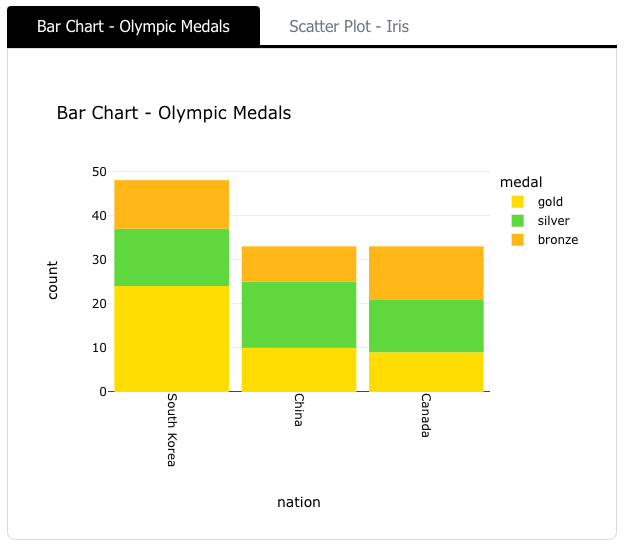
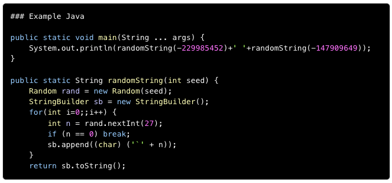
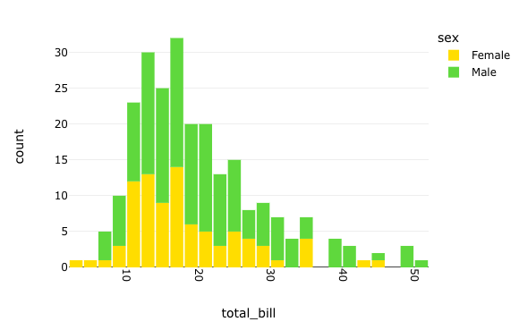
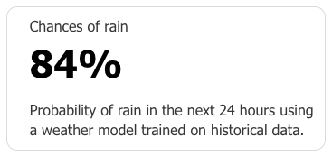
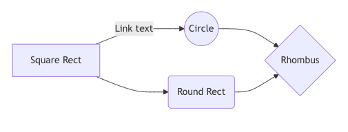

Getting Started
===============

.. _getting_started:

Installation
------------

To use ``report_creator``, first install it using pip:

.. admonition:: Install
   :class: note

   To install the package, run:

   .. code-block:: bash

      $ python -m pip install report_creator -U

Quick Start
-----------

.. code-block:: python

   import report_creator as rc

   with rc.ReportCreator(
      title="My Report",
      description="My Report Description",
      footer="My Report Footer",
      logo="octocat",
   ) as report:

      view = rc.Block(
         rc.Text("""It was the best of times, it was the worst of times, it was the age of wisdom, it was the age of foolishness, it was the epoch of belief, it was the epoch of incredulity, it was the season of light, it was the season of darkness, it was the spring of hope, it was the winter of despair.""", 
         label="Charles Dickens, A Tale of Two Cities"),
         rc.Group(
               rc.Metric(
                  heading="Answer to Life, The Universe, and Everything",
                  value="42",
               ),
               rc.Metric(
                  heading="Author",
                  value="Douglas Adams",
               ),   
         ),
         rc.Bar(px.data.medals_long(),
                  x="nation",
                  y="count",
                  dimension="medal",
                  label="Bar Chart - Olympic Medals",
         ),
         rc.Scatter(
               px.data.iris(),
               x="sepal_width",
               y="sepal_length",
               dimension="species",
               marginal="histogram",
               label="Scatter Plot - Iris",
         ),
      )

      report.save(view, "report.html") 


Logo
----

The ``logo`` parameter is optional. To include a logo in the report, pass a path 
to the logo file, a URL to a logo image, a base64 encoded image, or a GitHub handle.

When passing a GitHub handle, the image will be fetched from the GitHub repository. Since most 
companies have a GitHub account, this is a convenient way to include a 
logo (for example ``logo="apple"``).
 
If you do not provide a logo, the report will include an SVG-based logo that derives from the title of the report.

Layout
------

With an instance of ``rc.ReportCreator()`` you add components, there are two container components, one that lays out vertically, called
``rc.Block()`` and one that lays out child components horizontally called ``rc.Group()``. Every component allows for a 
label that is styled appropriate to the component. 

Tabs
----

A container called ``rc.Select()`` is used to show tabs. It should be noted that for reports that are printed the ``rc.Select()`` component might not be suitable.



Formatted Text
--------------

There are three types of text components, ``rc.Text()`` (deprecated in favor of ``rc.Markdown()``), ``rc.Html()``. The markdown is the 
GitHub extended syntax, tables will be rendered properly, and code within Markdown will be styled to match code in the code components.

Most components will accept a label, which is a string that may contain Markdown.


Code
----

There are components for ``rc.Yaml()``, ``rc.Json()``, ``rc.Python()``, ``rc.Prolog()``, ```rc.Java()``, ``rc.Shell()``, and ``rc.Sql()``,  each 
will format and render with color syntax highlighting. Plain text can also be styled as code with ``rc.Plaintext()``, although this
has limited use, it can be used to show code that is not in a common language.



Images
------

One of the goals of report creator is to be self-contained, images may not be visible, or available at view time so the ``rc.Image()``
component allows an option (``convert_to_base64``) which will retrieve at report creation time the image from the url and keep the 
local copy in the report. This can be used to get around CORS issues also. Images, like all the components will be styled and laid 
out to look consistent and attractive.

Charts
------

There are a number of charting components, ``rc.Radar(), ``rc.Bar()``, ``rc.Scatter()``, ``rc.Histogram()``, ``rc.Box()``, ``rc.Line()``, and ``rc.Pie()``.
These are wrappers around ``plotly express`` components. There is also a ``rc.Widget()`` component that can be used anywhere 
the object supports the ``repr_html()`` function that is used by Jupyter notebooks (for example ``matplotlib`` object)

.. code-block:: python3

      rc.Histogram(
         px.data.tips(),
         x="total_bill",
         dimension="sex",
         label="rc.Histogram() Chart of Total Bill",
      )



Tables
------

There are two types of table components, ``rc.Table()`` for simple tables, and ``rc.DataTable()`` for a richer experience, the data table
will paginate data, is searchable, supports export to pdf and print. Both table objects will construct from table-like objects. In the
``rc.DataTable()`` you can specify precision to keep numeric values more readable. 

Metrics
-------

A common use for reports is to show numeric/text results, like for example scores. These will be laid out in a flow that is responsive. 
You can also color them if you like, you can't change the color, only indicate that they should be colored. The layout engine will ensure
that background/text colors always have legible contrast, and that never adjacent metrics will have the same color. The default is a while
background. The component to use is called ``rc.Metric()`` - ctor elements for heading, value and optionally units. As with any component you
can also use a label which can serve as a description. Some times you have your data in a ``Pandas`` dataframe and it's inconvenient to 
expand the rows, in this case the component ``rc.MetricGroup()`` takes a dataframe and the column names for the headings and value, 
a component will be created *for each row.*

.. code-block:: python3

   rc.Metric(
      heading="Chances of rain",
      value="84",
      unit="%",
      label="Probability of rain in the next 24 hours using a weather model trained on historical data.",
   )



Miscellaneous
-------------

There are components also to be used as separators ``rc.Separator()``, to hide content under a drop down ``rc.Collapse()``, and 
to include diagrams in |mermaid_location_link| ``rc.Diagram()``

.. |mermaid_location_link| raw:: html

   <a href="https://mermaid.js.org/syntax/examples.html" target="_blank">Mermaid JS syntax</a>


.. code-block:: python3

   rc.Diagram("""
      graph LR
         A[Square Rect] -- Link text --> B((Circle))
         A --> C(Round Rect)
         B --> D{Rhombus}
         C --> D
      """)


